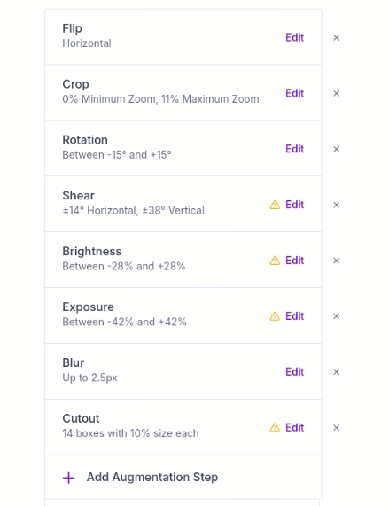

# Dataset - Criado no Roboflow 🍹

Este repositório contém o dataset utilizado para treinar o modelo de visão computacional, especificamente para o projeto **Tequila**, que foi criado na plataforma **Roboflow**. O dataset inclui imagens de rótulos e outros objetos relacionados ao contexto da aplicação.

## Sobre o Dataset 📊

O **dataset "Tequila"** foi criado usando imagens coletadas, com o objetivo de realizar tarefas de **detecção de objetos**. O conjunto de dados foi aprimorado utilizando as técnicas de **data augmentation** oferecidas diretamente pela plataforma **Roboflow**. 

### Técnicas de Data Augmentation Utilizadas 🔧

A **Roboflow** oferece uma variedade de técnicas de **aumento de dados** para melhorar a qualidade do treinamento e gerar uma maior variedade de imagens a partir de um número limitado de exemplos. Entre as técnicas de data augmentation utilizadas estão:

- **Rotação de Imagens**: A rotação das imagens em vários ângulos para tornar o modelo mais robusto à variação angular dos objetos.
- **Flip Horizontal e Vertical**: Espelhamento das imagens para que o modelo consiga reconhecer objetos de qualquer direção.
- **Alteração de Brilho e Contraste**: Aumento da variação de brilho e contraste das imagens para simular diferentes condições de iluminação.
- **Zoom In/Out**: Modificação do zoom nas imagens, ajudando o modelo a aprender a identificar objetos tanto em close-ups quanto em distâncias maiores.
- **Mudança de Saturação**: Alteração das cores das imagens para ajudar o modelo a aprender a distinguir objetos em diferentes condições de iluminação e saturação.

Essas técnicas foram aplicadas diretamente pela plataforma **Roboflow**, otimizando o processo de aumento de dados e garantindo uma maior robustez no treinamento do modelo.
<p align="center">
  
</p>


## Como Usar o Dataset 📥

O dataset está disponível para download no formato de pasta, facilitando a integração com seu projeto de treinamento de modelos. Para baixar o dataset, basta rodar o seguinte código Python:

```python
from roboflow import Roboflow

# Defina sua chave de API do Roboflow para o Dataset (Não há problema em ficar exposta)
rf = Roboflow(api_key="vEk0o12j7gIkeAzeGObz")

# Acesse o projeto no Roboflow
project = rf.workspace("nuven").project("tequila")

# Acesse a versão 3 do projeto
version = project.version(3)

# Faça o download do dataset no formato de pasta
dataset = version.download("folder")
```

### O que está no Dataset 📂

O dataset baixado inclui as imagens de treinamento com anotações de **detecção de objetos**, como caixas delimitadoras (bounding boxes) em torno dos objetos relevantes. As imagens estão organizadas em pastas para facilitar a organização do treinamento.

- **Imagens**: As imagens originais, com as anotações de detecção de objetos.
- **Anotações**: Arquivos de anotações em formato JSON ou XML, dependendo do tipo de exportação escolhido.

### Como Colocar a Imagem 🖼️

Para adicionar novas imagens ao dataset, basta seguir as etapas abaixo:

1. Prepare as imagens que você deseja adicionar ao dataset.
2. Faça upload diretamente na plataforma Roboflow ou adicione as imagens manualmente à pasta onde as imagens estão organizadas.
3. Se estiver utilizando Roboflow diretamente, as imagens serão automaticamente anotadas após o upload.

Caso esteja trabalhando com imagens locais, o processo de anotação manual pode ser feito por meio da interface do Roboflow.

---

## Considerações Finais 💡

O **dataset "Tequila"** foi criado para permitir que você treine modelos de detecção de objetos de forma eficiente, aproveitando ao máximo as técnicas de **data augmentation** disponíveis na plataforma **Roboflow**.

Essas técnicas garantem que o modelo possa aprender com um conjunto de dados mais diverso, melhorando a precisão e a robustez do modelo de visão computacional em diferentes cenários.

